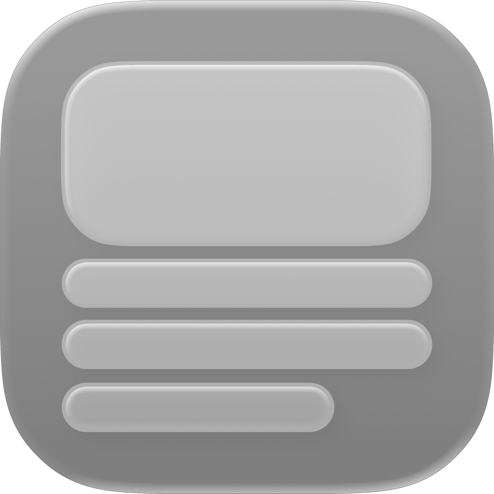
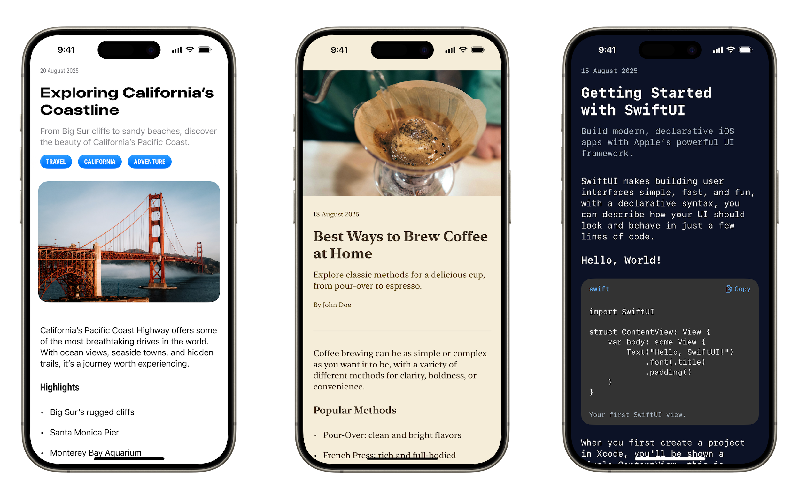

<div align="center">
  
  <h1>ArticleKit</h1>
  <p>
    A simple SwiftUI framework for creating rich and readable articles with customizable styling support.
  </p>
  <div align="center">
    
    
    
  </div>
</div>

---

## Overview

ArticleKit helps you create clean and customizable article reading experiences in SwiftUI applications, for blogs, how-to guides, or in-app articles.

## Features

- **Rich Content Blocks**: Support for text, images, quotes, code blocks, lists, and more
- **Flexible Styling**: Pre-built themes (classic, modern, reading, developer) with additional customization
- **JSON Support**: Load articles from JSON with clean, readable format
- **Accessibility**: Built-in VoiceOver support and accessibility labels

> **ArticleKit is in active development**. 
> The core architecture and API are stable, but new features and platform support are planned for the future.



## Installation

### Install with Swift Package Manager
1. In Xcode choose **File → Add Packages...**
2. Paste: `https://github.com/codegw/ArticleKit`
3. Select a version and add the package to your target.

Or add to `Package.swift`:

```swift
dependencies: [
    .package(url: "https://github.com/codegw/ArticleKit", from: "1.0.0")
]
```

## Quick Start

### Basic Usage

```swift
import SwiftUI
import ArticleKit

struct ContentView: View {
    let article = Article(
        id: "welcome-article",
        header: [
            .heroImage(.asset(name: "hero-image")),
            .title("Welcome to ArticleKit"),
            .author("John Appleseed", bio: "iOS Developer", avatarImage: .asset(name: "john-avatar"))
        ],
        content: [
            .heading("Getting Started"),
            .body("ArticleKit makes it easy to create beautiful, readable articles."),
            .image(.asset(name: "example-image"), caption: "A beautiful SwiftUI interface")
        ]
    )
    
    var body: some View {
        ArticleView(article: article)
            .articleStyle(.modern)
    }
}
```

### Loading from JSON

```swift
// From JSON string
let jsonString = """
{
  "id": "my-article",
  "header": [
    { "type": "title", "title": "My Article" },
    { "type": "author", "author": { "name": "John Appleseed", "bio": "Developer" } }
  ],
  "content": [
    { "type": "body", "body": "Article content here..." }
  ]
}
"""

do {
    let article = try Article.from(jsonString: jsonString)
    let articleView = ArticleView(article: article)
} catch {
    print("Failed to load article: \(error)")
}

// From bundle resource
if let url = Bundle.main.url(forResource: "article", withExtension: "json"),
   let data = try? Data(contentsOf: url) {
    let article = try Article.from(jsonData: data)
}
```

## Content Blocks

### Header Blocks

- **Hero Image**: `.heroImage(.asset(name: "hero-image"))`
- **Title**: `.title("Article Title")`
- **Subtitle**: `.subtitle("Article Subtitle")`
- **Author**: `.author("John", bio: "iOS Developer", avatarImage: .asset(name: "john-avatar"))`
- **Date**: `.date(Date())`
- **Topics**: `.topics(["iOS", "SwiftUI"])`

### Content Blocks

- **Headings**: `.heading("Section Title")`
- **Body Text**: `.body("Paragraph content")`
- **Images**: `.image(.asset(name: "example-image"), caption: "A beautiful SwiftUI interface")`
- **Quotes**: `.quote("Quote text", author: "Attribution")`
- **Code**: `.codeBlock("print('Hello')", language: "swift")`
- **Lists**: `.listItem(["Item 1", "Item 2"])`, `.numberedListItem([...])`
- **Dividers**: `.divider`

## Documentation

Documentation is available in the [ArticleKit Wiki](https://github.com/codegw/ArticleKit/wiki)

## Contributing

Contributions are welcome! Please read our [Contributing Guidelines](CONTRIBUTING.md) and [Code of Conduct](CODE_OF_CONDUCT.md).

## License

ArticleKit is available under the MIT License. See [LICENSE](LICENSE) for details.

## Support

If you like this project, give it a star ★

---

<div align="center">
  <p>
    Thank you for viewing ArticleKit!
  </p>
</div>
